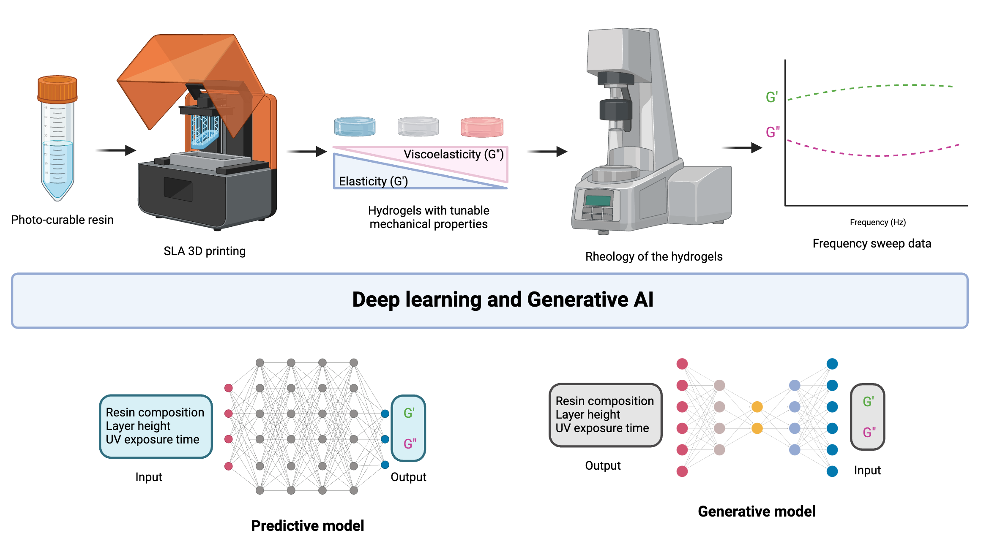

# Leveraging Deep Learning and Generative AI for Predicting Rheological and Material Composition for Additive Manufacturing of Polyacrylamide Hydrogels

This is a repository that contains the code and data of the following paper:  
📄 **[DOI: https://doi.org/10.3390/gels10100660](https://doi.org/10.3390/gels10100660)**  

---

## 📜 **Abstract**
Artificial intelligence (AI) has the ability to predict rheological properties and constituent composition of **3D-printed materials** with appropriately trained models. However, these models are not currently available for use.  

In this work, we trained deep learning (DL) models to:  
1. **Predict rheological properties** such as the **storage (G')** and **loss (G'') modulus** of 3D-printed polyacrylamide (PAA) hydrogels.  
2. **Generate material composition and 3D printing parameters** for a **desired pair of G' and G''**.  

We employed a **multilayer perceptron (MLP)** and successfully predicted G' and G'' from seven gel constituent parameters in a **multivariate regression process**. We then adopted two generative DL models (**VAE & CVAE**) to learn data patterns and generate synthetic compositions.  

📌 Our trained DL models were successful in mapping the **input–output relationship** for **3D-printed hydrogel substrates**, enabling prediction of **multiple variables from a handful of input variables and vice versa**.


---

## 📁 **Repository Structure**
```
/hydrogel_rheology_project
│── app.py                  
│── model.py                 
│── requirements.txt        
│── README.md                
│── Weights/                
│   ├── model_regression.pth
│   ├── model_cvae.pth
│── Scalers/                 
│   ├── scaler_regression.pkl
│   ├── scaler_cvae_x.pkl
│   ├── scaler_cvae_y.pkl
│── Data/
│   ├── Rheology data.xlsx
│   ├── abstract_graphical.png                
│── Notebooks/               
│   ├── Hydro_gen_test_paper.ipynb
│   ├── Hydrogel_MLP.ipynb
│   ├── Stats_hydrogel_paper.ipynb
```
🛠 Installation & Setup
Follow these steps to set up and run the project locally.

1️⃣ Create & Activate Virtual Environment
```
python3 -m venv env
source env/bin/activate  # (Linux/Mac)
env\Scripts\activate     # (Windows)
```
2️⃣ Install Dependencies
```
pip install --upgrade pip
pip install -r requirements.txt
```
3️⃣ Run the App
```
python3 app.py
```

